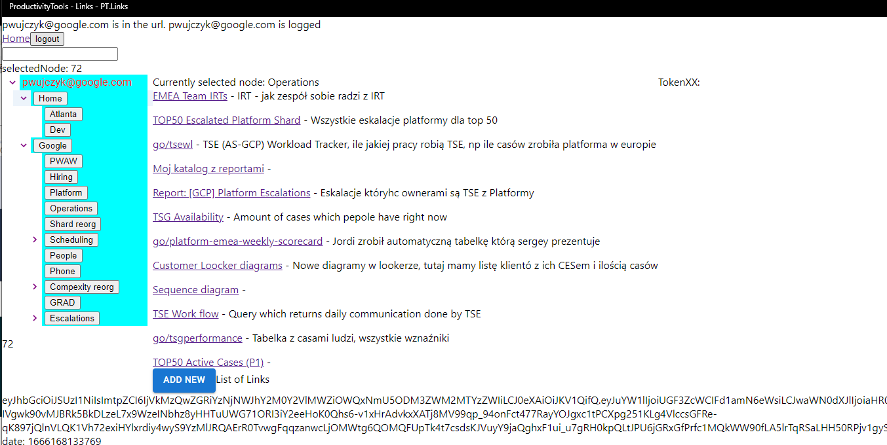
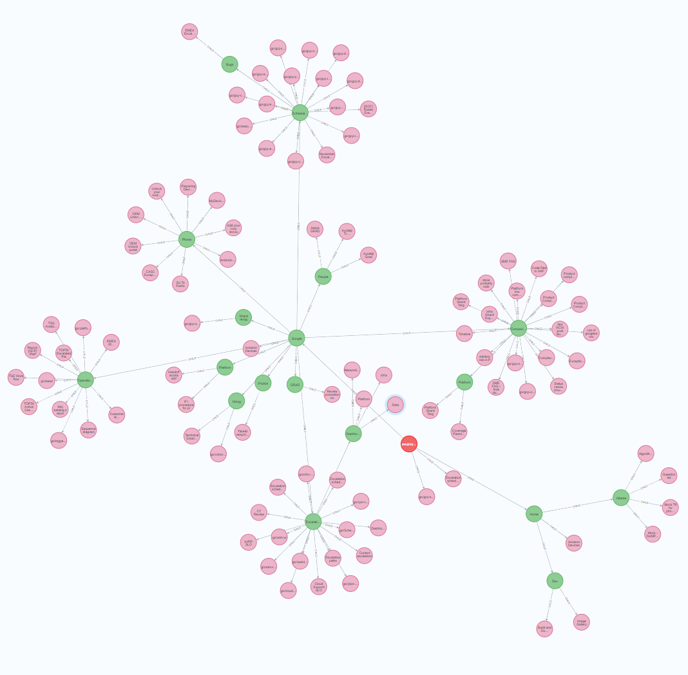
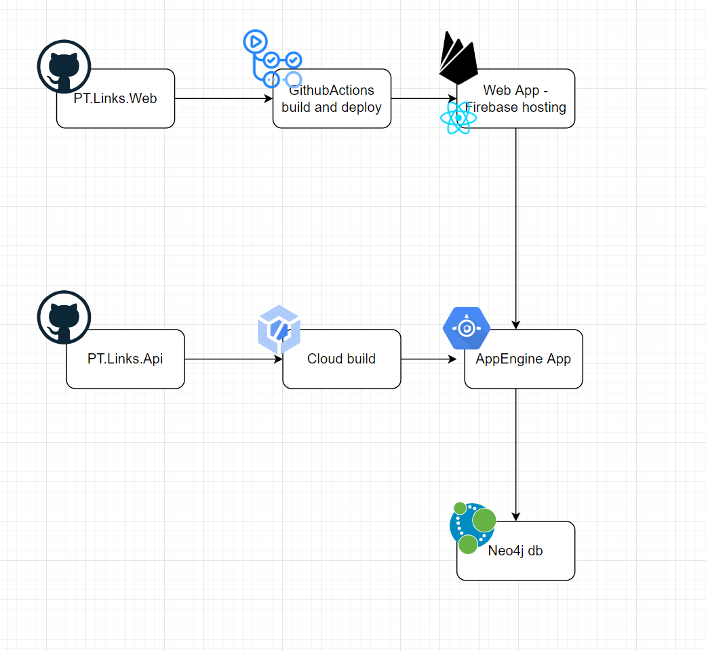

Application is replacement for the browser bookmarks. It also stores the links but in this application we can add metadata to each link. Right now it is the description. (next item to be added is frequency of usage)

## Database

Application is using Graph Neo4j database as a storage. Nodes are tree items (categories) and leafs actual links to pages

## Physical && CI/CD architecture

